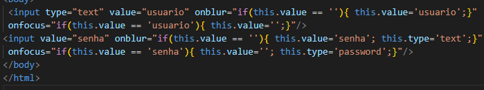
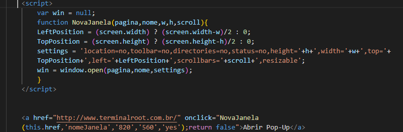

# Análise de código Javascript

Código 1-Inputs modificando após clique

De longe o tipo mais utilizado no HTML, o input text é utilizado para receber textos de qualquer tipo, tais como: nomes, telefones, emails etc.
especifica o número máximo de caracteres (em pontos de código Unicode) que o usuário pode inserir; 
para receber informações do tipo texto. Entretanto, ele aceita todos os tipos de dados do teclado, como letras, números e símbolos.
deve ser usado para especificar o conteúdo default do campo.
Você deve usar o atributo value para definir o valor enviado por este item.

Código 2-Abrir Pop-Up no Centro da Página

A palavra function é a forma da linguagem JavaScript indicar que estamos declarando uma função (criando a caixa mágica).
Através do atributo left é possível definir a posição horizontal do elemento em relação a sua borda esquerda.O position é uma propriedade CSS que define como um elemento deve ser posicionado página, ou seja, no corpo do documento o body, essa propriedade ( position ) pode ser acompanhada de outras, tais como, top (en-US), right (en-US), bottom (en-US), and left (en-US), que determinam como ficará a localização final do objeto, permitindo seu deslocamento, como será apresentado adiante.
Settings Sync é uma extensão do Visual Studio Code que permite realizar o backup e sincronização das suas configurações na ferramenta.